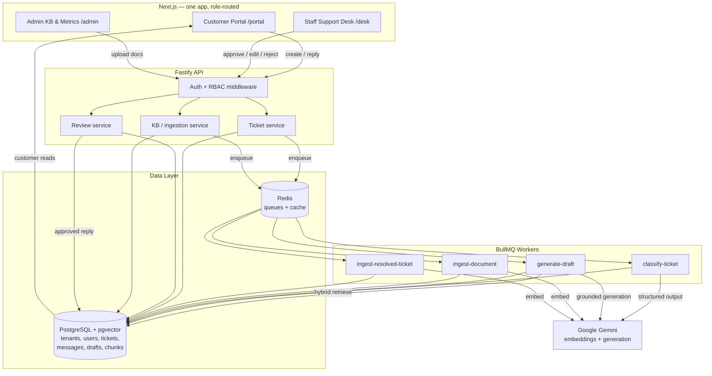
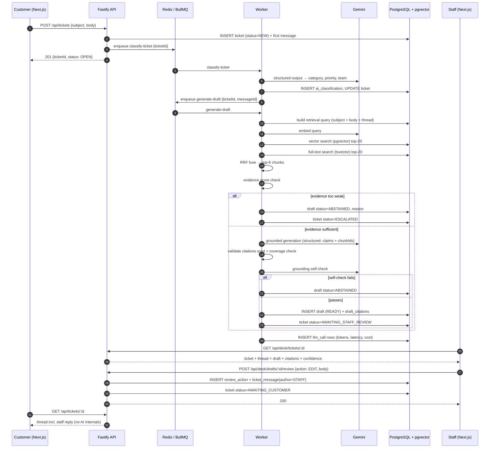
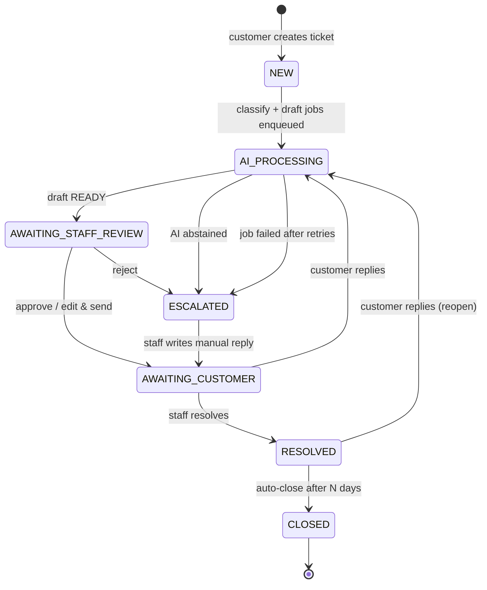
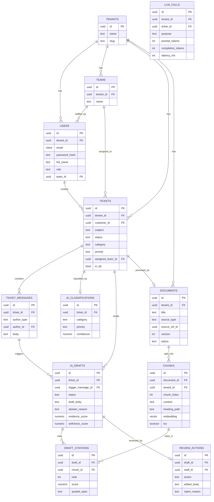

# SupportSense — Project Documentation

> **AI Support Copilot with grounded answers, citations, and human approval.**
> One application. One authentication system. Role-based portals.

---

## Table of Contents

1. [Product Overview](#1-product-overview)
2. [Real-World Problem](#2-real-world-problem)
3. [Target Users &amp; Personas](#3-target-users--personas)
4. [Customer Journey](#4-customer-journey)
5. [Staff / Support-Agent Journey](#5-staff--support-agent-journey)
6. [End-to-End System Flow](#6-end-to-end-system-flow)
7. [Where RAG Is Used and Why](#7-where-rag-is-used-and-why)
8. [Where the LLM Is Used and Why](#8-where-the-llm-is-used-and-why)
9. [RAG Pipeline in Detail](#9-rag-pipeline-in-detail)
10. [Ticket Lifecycle / State Machine](#10-ticket-lifecycle--state-machine)
11. [Database Schema Design](#11-database-schema-design)
12. [Authentication &amp; Role-Based Authorization](#12-authentication--role-based-authorization)
13. [Customer Portal Features](#13-customer-portal-features)
14. [Staff Support Desk Features](#14-staff-support-desk-features)
15. [API Design](#15-api-design)
16. [Backend Architecture](#16-backend-architecture)
17. [Frontend Architecture](#17-frontend-architecture)
18. [BullMQ / Redis Jobs](#18-bullmq--redis-jobs)
19. [pgvector Design](#19-pgvector-design)
20. [Hybrid Retrieval + RRF](#20-hybrid-retrieval--rrf)
21. [Citation / Provenance Design](#21-citation--provenance-design)
22. [Abstention / Escalation Logic](#22-abstention--escalation-logic)
23. [Human-in-the-Loop Approve / Edit / Reject](#23-human-in-the-loop-approve--edit--reject)
24. [How the Final Response Reaches the Customer](#24-how-the-final-response-reaches-the-customer)
25. [Feedback Loop: Resolved Tickets → RAG Data](#25-feedback-loop-resolved-tickets--rag-data)
26. [Evaluation Strategy &amp; Metrics](#26-evaluation-strategy--metrics)
27. [Observability](#27-observability)
28. [Multi-Tenant Isolation &amp; Security](#28-multi-tenant-isolation--security)
29. [Seed / Demo Data Strategy](#29-seed--demo-data-strategy)
30. [How to Demo This in an Interview](#30-how-to-demo-this-in-an-interview)
31. [Likely Interviewer Questions &amp; Answers](#31-likely-interviewer-questions--answers)
32. [MVP Scope — 3 Weeks](#32-mvp-scope--3-weeks)
33. [Optional Features NOT to Build Initially](#33-optional-features-not-to-build-initially)
34. [Future Production Architecture](#34-future-production-architecture)
35. [Resume Bullet Points](#35-resume-bullet-points)
36. [Worked Examples](#36-worked-examples)
37. [FINAL ARCHITECTURE DECISIONS](#37-final-architecture-decisions)

---

## 1. Product Overview

**SupportSense** is an internal support platform where customers raise tickets and support staff resolve them — with an AI copilot sitting between the two.

When a ticket arrives, SupportSense:

1. **Classifies** it (category, priority, suggested team) using structured LLM output.
2. **Retrieves** evidence from the company's own knowledge base *and* from previously resolved tickets using hybrid search (pgvector + PostgreSQL full-text, fused with RRF).
3. **Drafts** a grounded reply where every factual claim is tied to a specific retrieved chunk.
4. **Abstains and escalates** when the evidence is too weak to answer safely.
5. **Waits for a human.** A staff member approves, edits, or rejects the draft. Nothing is ever auto-sent.
6. **Learns** from the outcome — approved/edited replies on resolved tickets can be promoted back into the retrieval corpus.

The core product thesis is not "AI answers tickets." It is:

> **AI drafts only when it has evidence, always shows its sources, and a human always ships the final word.**

That is the difference between a demo and something a support team would actually switch on.

### What SupportSense is NOT

- Not a Zendesk/Intercom clone — no multi-channel inbox, no SLA engine, no billing, no macros library.
- Not an autonomous agent — no auto-send, no tool-calling agent loop, no agent-to-agent orchestration.
- Not "chat with PDF" — the unit of work is a **ticket with a lifecycle and an approval gate**, not a chat turn.

---

## 2. Real-World Problem

Support teams face three compounding problems:

**Problem 1 — Repetition.** A large share of inbound tickets are re-answers of questions already answered in the help center or in a ticket closed last week. Agents retype the same answer with slight variation. The knowledge exists; it is just not reachable at the moment of writing a reply.

**Problem 2 — Generic AI tools hallucinate confidently.** Bolt-on "AI reply" features generate fluent answers with no provenance. An agent cannot tell a correct answer from a fabricated one without independently researching it — which erases the time saving entirely. Worse, a wrong answer sent to a customer about refunds, SLAs, or data handling is a real business liability.

**Problem 3 — No graceful failure.** Most AI assistants always answer. There is no "I don't know." So the agent must review 100% of drafts with equal suspicion, and trust never accumulates.

**SupportSense's answer to all three:**

- Retrieval over *both* KB docs and resolved tickets captures institutional knowledge that lives in ticket history, not just documentation.
- Every claim carries a citation to a chunk the agent can expand and verify in one click.
- An explicit **abstention path**: when retrieval evidence or the model's own grounding self-check falls below threshold, no draft is produced — the ticket is escalated with a stated reason. The agent's attention is spent only where the AI signalled confidence, and the abstain rate is a measurable, tunable product metric.

---

## 3. Target Users & Personas

### Persona A — Priya, Customer (role: `CUSTOMER`)

Uses a SaaS product from a company that runs SupportSense. She wants a fast, correct answer and visibility into her ticket. She never sees anything about AI — to her, this is a normal support portal.

**Needs:** raise a ticket, see status, read replies, follow up.

### Persona B — Rahul, Support Agent (role: `STAFF`)

Handles 40–60 tickets a day for the Billing team. He is the actual user of the AI. He needs to decide in seconds whether a draft is safe to send.

**Needs:** a queue, a draft, visible sources, a confidence signal, and one-click approve / inline edit / reject.

### Persona C — Meera, Support Lead / Admin (role: `ADMIN`)

Owns the knowledge base and the team structure. She uploads and re-uploads KB documents, manages teams, promotes good resolved tickets into the retrieval corpus, and watches the quality metrics.

**Needs:** KB document management, ingestion status, promotion controls, an ops/eval dashboard.

> **Gap fixed:** the original plan had only CUSTOMER and STAFF. Someone must own the knowledge base and decide which resolved tickets are safe to reuse. An `ADMIN` role is added — it is a superset of `STAFF`, not a separate portal, so it costs almost nothing to build.

---

## 4. Customer Journey

1. **Login** at `/login` with email + password. One login form for everyone. JWT carries `{ userId, tenantId, role }`.
2. Router sees `role === 'CUSTOMER'` → redirects to `/portal`.
3. **Ticket list** — her tickets only, with status badges (Open / Awaiting your reply / Resolved).
4. **Create ticket** — subject, body, optional category hint. Submits to `POST /api/tickets`.
5. Ticket appears immediately with status **Open**. She sees *"Our team is reviewing your request"* — no AI language, no draft, no confidence score. **Customers never see AI internals.**
6. **Conversation view** — a threaded list of messages: hers and the staff replies. Staff replies look like ordinary agent replies (they are — a human approved every one).
7. **Follow-up** — she can reply on the thread. Her reply re-triggers the AI pipeline with conversation context.
8. **Resolution** — when staff marks the ticket resolved, she sees a Resolved badge. Replying again reopens the ticket.

**Explicitly hidden from the customer:** classification, draft, citations, confidence, abstention, model names, tokens.

---

## 5. Staff / Support-Agent Journey

1. **Login** — same form. `role === 'STAFF'` → `/desk`.
2. **Queue** — tickets assigned to his team, sorted by priority then age. Each row shows: subject, customer, AI category/priority chips, and an **AI state chip**: `Draft ready` · `Escalated — no evidence` · `Processing` · `Awaiting customer`.
3. **Open ticket** — a three-panel workspace:
   - **Left:** full conversation thread (original customer message + all prior messages).
   - **Centre:** the AI draft in an editable textarea, with inline citation markers `[1] [2]`.
   - **Right:** the **Evidence panel** — every retrieved chunk with its source title, source type (KB doc vs resolved ticket), hybrid score, and the exact quoted span the draft used. Clicking `[1]` in the draft scrolls to and highlights source 1.
4. **Confidence strip** above the draft: evidence score, grounding self-check score, number of cited sources, and the decision (`ANSWER` / `ABSTAIN`) with reason.
5. **Three actions:**
   - **Approve** — send the draft verbatim.
   - **Edit & Send** — modify the text, then send. The diff between draft and sent text is stored (this is training signal and a metric).
   - **Reject / Escalate** — discard the draft with a reason from a short taxonomy (`WRONG_FACTS`, `MISSING_CONTEXT`, `TONE`, `POLICY`, `OTHER`), then write a manual reply or reassign.
6. **Escalated tickets** (AI abstained) show no draft — instead the Evidence panel shows what *was* retrieved and why it was insufficient, so the agent still gets a research head start.
7. **Resolve** — marks the ticket resolved and optionally ticks **"Add to knowledge base"**, which queues the resolved thread for ingestion.

---

## 6. End-to-End System Flow



### Complete ticket sequence



---

## 7. Where RAG Is Used and Why

RAG is used at exactly **one** point: generating the draft reply.

**Why RAG and not fine-tuning or a long prompt:**

- **Freshness.** Support policies change weekly. Re-ingesting a document takes seconds; retraining does not.
- **Provenance.** The agent must see *which* document said the refund window is 30 days. Only retrieval gives you a chunk ID to point at. A fine-tuned model cannot cite.
- **Tenant isolation.** Each tenant's corpus is different and must never leak. Retrieval scoped by `tenant_id` is a hard boundary; a shared fine-tuned model is not.
- **Cost/latency.** Stuffing an entire KB into a long context on every ticket is wasteful and degrades precision. Retrieving 6 chunks is cheap and sharper.

**Two corpora, deliberately:**

| Corpus                     | Why it matters                                                                                                                                             |
| -------------------------- | ---------------------------------------------------------------------------------------------------------------------------------------------------------- |
| **KB documents**     | Canonical policy. Authoritative but often written generically.                                                                                             |
| **Resolved tickets** | Institutional knowledge — the actual phrasing, edge cases, and workarounds agents discovered. This is the knowledge that normally dies in ticket history. |

Retrieving over both is what makes this more than a docs search bot. A `source_type` field lets the ranker and the UI distinguish "policy says" from "we handled this before."

**Where RAG is deliberately NOT used:** classification. Categorising a ticket needs the tenant's taxonomy (a short list injected directly into the prompt), not retrieval. Adding RAG there would be complexity for no accuracy gain.

---

## 8. Where the LLM Is Used and Why

Four distinct LLM calls, each with a narrow job and structured output:

| # | Call                                           | Model role | Input                                   | Output (structured)                                                      | Why an LLM                                                                                                                       |
| - | ---------------------------------------------- | ---------- | --------------------------------------- | ------------------------------------------------------------------------ | -------------------------------------------------------------------------------------------------------------------------------- |
| 1 | **Classify**                             | Gemini     | ticket subject + body + tenant taxonomy | `{category, priority, suggestedTeam, confidence, reasoning}`           | Free-text intent → fixed taxonomy. Rules/keywords break on paraphrase.                                                          |
| 2 | **Query construction** (follow-ups only) | Gemini     | last 4 thread messages                  | `{searchQuery}`                                                        | A follow-up like*"still not working"* is meaningless as a search query. Needs thread context resolved into a standalone query. |
| 3 | **Grounded generation**                  | Gemini     | ticket + top-K chunks                   | `{replyMarkdown, claims:[{text, chunkIds[]}], usedChunkIds[]}`         | Synthesise a customer-ready reply from evidence, with claim→chunk mapping.                                                      |
| 4 | **Grounding self-check**                 | Gemini     | draft + chunks                          | `{fullySupported: bool, unsupportedClaims[], confidence, missingInfo}` | A second, adversarial pass catches claims the generator invented. Cheap hallucination insurance.                                 |

**Structured output everywhere.** Every call uses Gemini's JSON schema / response-schema mode and is validated with Zod on receipt. If validation fails → one retry with the validation error appended → then fail the job to a dead-letter state. No regex parsing of prose, ever.

> **Design note:** call 4 is a *separate* call, not a "rate yourself" field appended to call 3. A generator asked to grade its own output in the same breath is systematically over-confident. A fresh call that only sees the draft and the chunks, and is prompted to hunt for unsupported claims, is meaningfully stricter.

---

## 9. RAG Pipeline in Detail

### 9.1 Ingestion (async, BullMQ)

```
Upload / promote
  → normalize to plain text (markdown, .txt, .md; PDF via pdf-parse — optional)
  → create documents row (status=PROCESSING, version=n)
  → chunk
  → embed each chunk (Gemini, batched)
  → INSERT chunks (content, embedding, tsv, metadata)
  → documents.status = ACTIVE
  → archive previous version's chunks
```

**Chunking strategy — structure-aware, not blind:**

- **KB documents:** split on markdown headings first. If a heading section exceeds ~450 tokens, split further on paragraph boundaries with ~60-token overlap. Each chunk carries `heading_path` (e.g. `Billing > Refunds > Eligibility`) which is prepended to the embedded text — this materially improves retrieval because the chunk body alone often lacks its own topic words.
- **Resolved tickets:** one chunk per Q/A pair: the customer's problem statement + the final approved staff reply, concatenated. Never chunk a ticket mid-answer — the question and its answer must retrieve together or neither is useful.
- **Target:** 300–500 tokens per chunk. Small enough for precision, large enough to be self-contained.

**Versioning:** re-uploading a document creates version `n+1`. Old chunks are marked `ARCHIVED` rather than deleted, so historical drafts keep resolvable citations. Retrieval filters to `ACTIVE` only.

### 9.2 Retrieval (per ticket)

```
query text
  → (follow-up? → LLM query construction)
  → embed query (Gemini, same model + task_type as ingestion)
  → BRANCH A: pgvector cosine, top 20, WHERE tenant_id = $1 AND status='ACTIVE'
  → BRANCH B: PostgreSQL FTS ts_rank_cd, top 20, same filters
  → RRF fusion (k=60) → ranked list
  → take top 6
  → evidence scoring
  → context construction
```

### 9.3 Context construction

Chunks are assembled into the prompt with **explicit IDs the model must cite**:

```
[1] (KB_DOC · "Refund Policy" · Billing > Refunds > Eligibility)
Refunds are available within 30 days of purchase for annual plans...

[2] (RESOLVED_TICKET · #4821 "Charged twice for annual plan")
Customer reported a duplicate charge... Resolution: duplicate charges are
auto-reversed within 5–7 business days; agents should confirm the...
```

Rules enforced by prompt + post-validation:

- Answer **only** from the numbered sources.
- Every factual claim must reference at least one source ID.
- If the sources do not contain the answer, return `insufficient_evidence: true` rather than guessing.
- Never invent source numbers.

### 9.4 Generation & validation

1. Call Gemini with the structured response schema.
2. **Validate citation IDs**: every `chunkId` returned must be in the set that was sent. Any unknown ID → treat as hallucination → abstain.
3. **Coverage check**: compute the fraction of claims that carry ≥1 citation. Below `MIN_CLAIM_COVERAGE` (0.8) → abstain.
4. **Self-check call**: adversarial grounding review. `fullySupported === false` with high-severity unsupported claims → abstain.
5. Persist draft + `draft_citations` rows (one per cited chunk, with rank, hybrid score, and the quoted span).

---

## 10. Ticket Lifecycle / State Machine



**Invariants:**

- A ticket has **at most one** draft in `READY` state. When a customer replies while a draft is pending, the pending draft is marked `SUPERSEDED` and a new draft job is enqueued for the new message. This prevents an agent sending a reply that ignores a message the customer just sent.
- A message is only visible to the customer if `author_type IN ('CUSTOMER','STAFF')`. Drafts live in a separate table and are never in the message thread until a human sends them.
- Every state transition is written in the same transaction as the row that caused it.

> **Gap fixed:** the original flow had no handling for "customer replies while the AI draft is still pending" or "the draft job crashed." Both are now explicit states with defined behaviour.

---

## 11. Database Schema Design



### Key DDL

```sql
CREATE EXTENSION IF NOT EXISTS vector;
CREATE EXTENSION IF NOT EXISTS citext;
CREATE EXTENSION IF NOT EXISTS pgcrypto;

CREATE TYPE user_role     AS ENUM ('CUSTOMER','STAFF','ADMIN');
CREATE TYPE ticket_status AS ENUM ('NEW','AI_PROCESSING','AWAITING_STAFF_REVIEW',
                                   'ESCALATED','AWAITING_CUSTOMER','RESOLVED','CLOSED');
CREATE TYPE draft_status  AS ENUM ('PENDING','READY','ABSTAINED','SUPERSEDED','FAILED');
CREATE TYPE author_type   AS ENUM ('CUSTOMER','STAFF','SYSTEM');
CREATE TYPE source_type   AS ENUM ('KB_DOC','RESOLVED_TICKET');
CREATE TYPE review_action AS ENUM ('APPROVE','EDIT','REJECT');

CREATE TABLE tenants (
  id         uuid PRIMARY KEY DEFAULT gen_random_uuid(),
  name       text NOT NULL,
  slug       citext UNIQUE NOT NULL,
  created_at timestamptz NOT NULL DEFAULT now()
);

CREATE TABLE users (
  id            uuid PRIMARY KEY DEFAULT gen_random_uuid(),
  tenant_id     uuid NOT NULL REFERENCES tenants(id) ON DELETE CASCADE,
  email         citext NOT NULL,
  password_hash text NOT NULL,
  full_name     text NOT NULL,
  role          user_role NOT NULL,
  team_id       uuid REFERENCES teams(id),
  is_active     boolean NOT NULL DEFAULT true,
  created_at    timestamptz NOT NULL DEFAULT now(),
  UNIQUE (tenant_id, email)
);
-- email is unique PER TENANT, not globally: the same person may be a
-- customer of two tenants. Login therefore resolves tenant first (see §12).

CREATE TABLE chunks (
  id              uuid PRIMARY KEY DEFAULT gen_random_uuid(),
  tenant_id       uuid NOT NULL REFERENCES tenants(id) ON DELETE CASCADE,
  document_id     uuid NOT NULL REFERENCES documents(id) ON DELETE CASCADE,
  chunk_index     int  NOT NULL,
  content         text NOT NULL,
  heading_path    text,
  token_count     int  NOT NULL,
  embedding       vector(768) NOT NULL,
  embedding_model text NOT NULL,
  tsv             tsvector GENERATED ALWAYS AS (
                    to_tsvector('english', coalesce(heading_path,'') || ' ' || content)
                  ) STORED,
  created_at      timestamptz NOT NULL DEFAULT now()
);

CREATE INDEX chunks_embedding_idx ON chunks
  USING hnsw (embedding vector_cosine_ops) WITH (m = 16, ef_construction = 64);
CREATE INDEX chunks_tsv_idx      ON chunks USING gin (tsv);
CREATE INDEX chunks_tenant_idx   ON chunks (tenant_id);

CREATE TABLE ai_drafts (
  id                 uuid PRIMARY KEY DEFAULT gen_random_uuid(),
  tenant_id          uuid NOT NULL REFERENCES tenants(id) ON DELETE CASCADE,
  ticket_id          uuid NOT NULL REFERENCES tickets(id) ON DELETE CASCADE,
  trigger_message_id uuid NOT NULL REFERENCES ticket_messages(id),
  status             draft_status NOT NULL DEFAULT 'PENDING',
  draft_body         text,
  abstain_reason     text,
  evidence_score     numeric(4,3),
  selfcheck_score    numeric(4,3),
  claim_coverage     numeric(4,3),
  model              text,
  latency_ms         int,
  created_at         timestamptz NOT NULL DEFAULT now()
);

-- At most one live draft per ticket.
CREATE UNIQUE INDEX one_ready_draft_per_ticket
  ON ai_drafts (ticket_id) WHERE status IN ('PENDING','READY');
```

---

## 12. Authentication & Role-Based Authorization

**One auth system, one login page, one JWT.** Role determines routing and permissions — never a separate login.

### Login flow

```
POST /api/auth/login { email, password, tenantSlug }
  → SELECT user WHERE tenant_id = (slug lookup) AND email = $email
  → bcrypt.compare
  → issue access JWT (15 min) + refresh token (httpOnly cookie, 7 days)
  → JWT claims: { sub: userId, tid: tenantId, role, teamId }
```

`tenantSlug` comes from the subdomain or a field on the login form (demo uses a dropdown of the two seeded tenants). This is why email is unique *per tenant*, not globally.

### Authorization layers

**Layer 1 — Route guard (Fastify preHandler).** `requireRole('STAFF','ADMIN')` on `/api/desk/*`, `requireRole('ADMIN')` on `/api/admin/*`.

**Layer 2 — Resource ownership.** A `CUSTOMER` may only read tickets where `customer_id = req.user.sub`. A `STAFF` may only read tickets where `assigned_team_id = req.user.teamId`. Enforced in the query, never with a post-fetch filter.

**Layer 3 — Row Level Security (the real boundary).** Every tenant-scoped table has RLS enabled:

```sql
ALTER TABLE tickets ENABLE ROW LEVEL SECURITY;
CREATE POLICY tenant_isolation ON tickets
  USING (tenant_id = current_setting('app.tenant_id')::uuid);
```

Every request (and every worker job) opens its connection and runs `SET LOCAL app.tenant_id = $1` inside the transaction before any query. The application connects as a non-superuser role that does **not** have `BYPASSRLS`.

This is deliberately belt-and-braces: even a developer who forgets a `WHERE tenant_id = ...` in a new query cannot leak cross-tenant data. That is the point — and it is the thing worth saying out loud in an interview.

### Frontend routing

Next.js middleware reads the session and redirects: `CUSTOMER → /portal`, `STAFF → /desk`, `ADMIN → /admin` (with `/desk` also accessible). Direct navigation to a portal you don't own returns 403 from the API regardless of what the client renders — the frontend guard is UX, not security.

---

## 13. Customer Portal Features

| Feature           | Notes                                                                                                                                                                                                                                     |
| ----------------- | ----------------------------------------------------------------------------------------------------------------------------------------------------------------------------------------------------------------------------------------- |
| Ticket list       | Own tickets only. Status badge, last-updated, unread indicator.                                                                                                                                                                           |
| Create ticket     | Subject + body. Optional category hint (not binding — AI classifies independently).                                                                                                                                                      |
| Ticket detail     | Threaded conversation, chronological.                                                                                                                                                                                                     |
| Reply on thread   | Re-triggers the AI pipeline.                                                                                                                                                                                                              |
| Status visibility | `Open` / `Awaiting your reply` / `Resolved`. Internal states (`AI_PROCESSING`, `ESCALATED`, `AWAITING_STAFF_REVIEW`) all display as **Open** — customers must not see AI internals or that their ticket was escalated. |
| Reopen            | Replying to a resolved ticket reopens it.                                                                                                                                                                                                 |

**Not built:** attachments, CSAT survey, ticket search, notifications.

---

## 14. Staff Support Desk Features

| Feature                   | Notes                                                                                                                                                    |
| ------------------------- | -------------------------------------------------------------------------------------------------------------------------------------------------------- |
| Team queue                | Tickets for`req.user.teamId`. Sort by priority, then oldest-first.                                                                                     |
| AI state chips            | `Draft ready` · `Escalated` · `Processing` · `Awaiting customer`.                                                                             |
| Ticket workspace          | 3 panels: thread · draft · evidence.                                                                                                                   |
| AI classification display | Category, priority, suggested team, classifier confidence.                                                                                               |
| Editable draft            | Textarea pre-filled with`draft_body`, citation markers rendered as clickable chips.                                                                    |
| Evidence panel            | Each chunk: source title,`KB_DOC` / `RESOLVED_TICKET` badge, hybrid score, heading path, full text (expandable), and the quoted span the draft used. |
| Confidence strip          | Evidence score, self-check score, claim coverage, decision + reason.                                                                                     |
| Approve                   | Sends verbatim.                                                                                                                                          |
| Edit & Send               | Sends edited text; stores both versions + a similarity score.                                                                                            |
| Reject / Escalate         | Reason from taxonomy; draft discarded; agent writes manually.                                                                                            |
| Manual reply              | Always available, with or without a draft.                                                                                                               |
| Resolve ticket            | Optional**"Add to knowledge base"** checkbox → queues promotion.                                                                                  |
| Reassign team             | Simple dropdown, in case the AI's team suggestion was wrong.                                                                                             |

---

## 15. API Design

All routes are prefixed `/api`. All require `Authorization: Bearer <jwt>` except `/auth/*`.

### Auth

```
POST   /auth/login              { email, password, tenantSlug } → { accessToken, user }
POST   /auth/refresh            (cookie)                        → { accessToken }
POST   /auth/logout
GET    /auth/me                                                 → { user }
```

### Customer

```
GET    /tickets                 → own tickets (paginated)
POST   /tickets                 { subject, body }               → ticket
GET    /tickets/:id             → ticket + messages
POST   /tickets/:id/messages    { body }                        → message (re-triggers AI)
```

### Staff desk

```
GET    /desk/tickets            ?status=&priority=&page=        → team queue
GET    /desk/tickets/:id        → ticket + thread + classification + draft + citations
POST   /desk/drafts/:id/review  { action, body?, rejectReason? }→ result
POST   /desk/tickets/:id/reply  { body }                        → manual reply
POST   /desk/tickets/:id/resolve{ addToKb: boolean }            → ok
POST   /desk/tickets/:id/assign { teamId }                      → ok
```

### Admin

```
GET    /admin/documents                                         → list + ingestion status
POST   /admin/documents         { title, content } | multipart  → queued
DELETE /admin/documents/:id                                     → archive
GET    /admin/metrics           ?days=7                         → ops + quality metrics
GET    /admin/eval/latest                                       → last eval run results
```

### Request / response examples

**Create ticket**

```http
POST /api/tickets
Authorization: Bearer eyJhbGciOi...
Content-Type: application/json

{
  "subject": "Charged twice for my annual plan",
  "body": "Hi, I upgraded to the annual plan on 12 August and I can see two charges of $240 on my card statement, both dated 12 August. Can you refund the duplicate? Order ref ORD-99381."
}
```

```json
201 Created
{
  "id": "9f3c1a72-...",
  "subject": "Charged twice for my annual plan",
  "status": "OPEN",
  "createdAt": "2026-08-26T09:14:02.331Z",
  "messages": [
    { "id": "1a2b...", "authorType": "CUSTOMER", "body": "Hi, I upgraded...", "createdAt": "..." }
  ]
}
```

**Staff ticket detail**

```json
200 OK
{
  "ticket": {
    "id": "9f3c1a72-...",
    "subject": "Charged twice for my annual plan",
    "status": "AWAITING_STAFF_REVIEW",
    "customer": { "id": "...", "fullName": "Priya Nair", "email": "priya@example.com" }
  },
  "classification": {
    "category": "BILLING",
    "priority": "HIGH",
    "suggestedTeam": "Billing",
    "confidence": 0.94,
    "reasoning": "Duplicate charge with order reference; financial impact."
  },
  "draft": {
    "id": "d41c...",
    "status": "READY",
    "body": "Hi Priya,\n\nThanks for flagging this...",
    "evidenceScore": 0.81,
    "selfcheckScore": 0.93,
    "claimCoverage": 1.0,
    "decision": "ANSWER",
    "latencyMs": 2840
  },
  "citations": [
    {
      "marker": 1,
      "chunkId": "c77a...",
      "sourceType": "KB_DOC",
      "sourceTitle": "Billing & Refunds Policy",
      "headingPath": "Billing > Duplicate Charges",
      "score": 0.0328,
      "quotedSpan": "Duplicate charges are automatically reversed within 5–7 business days.",
      "content": "Duplicate charges are automatically reversed within 5–7 business days. If the reversal has not appeared after 7 business days, agents should raise a manual refund request..."
    },
    {
      "marker": 2,
      "chunkId": "c91b...",
      "sourceType": "RESOLVED_TICKET",
      "sourceTitle": "#4821 — Charged twice for annual plan",
      "score": 0.0311,
      "quotedSpan": "confirm the order reference and advise the customer to allow one full billing cycle",
      "content": "Customer reported a duplicate charge on an annual upgrade..."
    }
  ]
}
```

**Review a draft**

```http
POST /api/desk/drafts/d41c.../review
{
  "action": "EDIT",
  "body": "Hi Priya,\n\nThanks for flagging this — I can see both charges against ORD-99381..."
}
```

```json
200 OK
{
  "draftId": "d41c...",
  "action": "EDIT",
  "messageId": "m55f...",
  "ticketStatus": "AWAITING_CUSTOMER",
  "editSimilarity": 0.78
}
```

**Error shape (consistent everywhere)**

```json
{ "error": { "code": "FORBIDDEN_TEAM_SCOPE",
             "message": "Ticket is not assigned to your team.",
             "requestId": "req_01J..." } }
```

---

## 16. Backend Architecture

**Single Fastify application + a worker process. No microservices.**

```
apps/api/src/
  server.ts                # Fastify bootstrap, plugins, graceful shutdown
  plugins/
    db.ts                  # pg Pool; withTenant() helper sets app.tenant_id
    auth.ts                # JWT verify → req.user
    rbac.ts                # requireRole(), requireTeamScope()
    queues.ts              # BullMQ queue instances
  modules/
    auth/                  # routes, service
    tickets/               # customer-facing
    desk/                  # staff-facing
    admin/                 # KB + metrics
  ai/
    gemini.ts              # thin client: embed(), generate(), all calls logged to llm_calls
    schemas.ts             # Zod schemas for all 4 structured outputs
    classify.ts
    retrieve.ts            # vector + FTS + RRF
    generate.ts            # context build, generation, citation validation
    selfcheck.ts
    decide.ts              # abstention decision matrix
  lib/ errors.ts, logger.ts, config.ts

apps/worker/src/
  index.ts                 # registers all 4 processors
  processors/
    classifyTicket.ts
    generateDraft.ts
    ingestDocument.ts
    ingestResolvedTicket.ts

packages/shared/           # types + Zod schemas shared with the Next.js app
```

**Why one API + one worker:** every job here is bounded and low-volume. Splitting into services would add deployment complexity with zero architectural benefit, and would be the wrong answer in an interview. The *seam* that matters (sync API vs async LLM work) is already drawn correctly by the queue.

**The `withTenant` helper** is the single most important piece of infrastructure code:

```ts
export async function withTenant<T>(tenantId: string, fn: (c: PoolClient) => Promise<T>) {
  const client = await pool.connect();
  try {
    await client.query('BEGIN');
    await client.query('SET LOCAL app.tenant_id = $1', [tenantId]);
    const result = await fn(client);
    await client.query('COMMIT');
    return result;
  } catch (e) { await client.query('ROLLBACK'); throw e; }
  finally { client.release(); }
}
```

Every request handler and every job processor goes through it. `SET LOCAL` is transaction-scoped, so a pooled connection can never carry one tenant's context into another's request.

---

## 17. Frontend Architecture

**Next.js App Router, one app, three route groups.**

```
apps/web/src/app/
  (auth)/login/page.tsx
  (customer)/portal/page.tsx
  (customer)/portal/tickets/[id]/page.tsx
  (staff)/desk/page.tsx
  (staff)/desk/tickets/[id]/page.tsx
  (admin)/admin/documents/page.tsx
  (admin)/admin/metrics/page.tsx
  middleware.ts            # role-based redirect
components/
  ticket/ThreadView, MessageComposer, StatusBadge
  desk/QueueTable, DraftEditor, EvidencePanel, ConfidenceStrip, ReviewActions
  admin/DocumentUploader, IngestionStatus, MetricsCards
lib/ api.ts (typed fetch), auth.ts, hooks/
```

- **State:** TanStack Query for server state. No Redux — there is no meaningful client state beyond forms.
- **Polling, not websockets:** the ticket detail page polls every 3s while `status IN ('AI_PROCESSING')`, and the desk queue polls every 10s. Drafts take 2–5 seconds; a websocket layer here is complexity for a barely perceptible gain. Say this deliberately in an interview — knowing when *not* to add realtime infrastructure is a signal.
- **Citation interaction:** `[1]` chips in the draft are anchors; clicking scrolls the Evidence panel to that chunk and highlights the quoted span. This is the single most demo-able piece of UI in the product — invest in it.

---

## 18. BullMQ / Redis Jobs

| Queue                      | Trigger                                 | Payload                               | Concurrency | Attempts | Backoff  |
| -------------------------- | --------------------------------------- | ------------------------------------- | ----------- | -------- | -------- |
| `classify-ticket`        | ticket created                          | `{ tenantId, ticketId }`            | 5           | 3        | exp, 2s  |
| `generate-draft`         | after classify, or new customer message | `{ tenantId, ticketId, messageId }` | 3           | 3        | exp, 5s  |
| `ingest-document`        | admin uploads KB doc                    | `{ tenantId, documentId }`          | 2           | 3        | exp, 10s |
| `ingest-resolved-ticket` | staff resolves with`addToKb`          | `{ tenantId, ticketId }`            | 2           | 3        | exp, 10s |

**Job design rules:**

- **Idempotency via jobId.** `generate-draft` uses `jobId = draft:${messageId}`. A duplicated enqueue is deduped by BullMQ rather than producing two drafts.
- **Supersede-on-newer-message.** Before writing a draft, the processor re-checks that `trigger_message_id` is still the ticket's latest customer message. If not, it writes `SUPERSEDED` and exits without calling Gemini — saves tokens and prevents stale drafts.
- **Failure is a product state, not a crash.** After final retry, `generate-draft` sets `draft.status = FAILED` and `ticket.status = ESCALATED`. The agent sees "AI unavailable — please handle manually." The system degrades to a plain ticketing tool, which is exactly what it should do.
- **Redis also serves:** an embedding cache (`emb:{sha256(text)}` → vector, 24h TTL) which makes repeated eval runs nearly free, and simple per-tenant rate-limit counters.

**Why async at all:** a draft takes 2–5s (embed + 2 LLM calls + retrieval). Blocking the customer's POST on that would be a bad API and a fragile one. The queue also gives free retries, backpressure, and a place to measure — the whole reason to reach for BullMQ rather than a floating promise.

---

## 19. pgvector Design

- **Embedding model:** Gemini `gemini-embedding-001` at **768 dimensions**. 768 keeps the vector well inside pgvector's HNSW limit, keeps the index small, and is more than sufficient for a corpus of hundreds of chunks.
- **Task types matter:** ingest with `RETRIEVAL_DOCUMENT`, query with `RETRIEVAL_QUERY`. Using the same task type for both is a common and silent quality bug.
- **Distance:** cosine (`vector_cosine_ops`). Similarity = `1 - (embedding <=> query)`.
- **Index:** HNSW (`m=16, ef_construction=64`). Chosen over IVFFlat because HNSW needs no training data and performs well on a small, growing corpus — IVFFlat's list count must be tuned to row count, which is wrong for a corpus that starts near-empty.
- **`embedding_model` column on every chunk.** Changing embedding models means re-embedding the whole corpus; storing the model per chunk makes a mixed-model corpus detectable rather than silently broken.
- **Filtering:** `tenant_id` and `status='ACTIVE'` are applied as `WHERE` clauses alongside the ANN search. At this corpus size the planner handles this fine; the ceiling and its fix are noted in §34.

```sql
-- vector branch
SELECT c.id, c.content, 1 - (c.embedding <=> $1::vector) AS score
FROM chunks c
JOIN documents d ON d.id = c.document_id
WHERE c.tenant_id = current_setting('app.tenant_id')::uuid
  AND d.status = 'ACTIVE'
ORDER BY c.embedding <=> $1::vector
LIMIT 20;
```

---

## 20. Hybrid Retrieval + RRF

### Why hybrid

Dense vectors capture meaning but miss **exact tokens**: order refs (`ORD-99381`), error codes (`ERR_402_DECLINED`), plan names, feature names. Support tickets are full of these. Lexical search nails them but fails on paraphrase (*"money taken twice"* vs *"duplicate charge"*).

Support queries need both. That is the honest justification — not "hybrid is better," but "this specific corpus contains identifiers that dense retrieval demonstrably loses."

### The two branches

**A — Dense:** pgvector cosine over the query embedding, top 20.
**B — Lexical:** PostgreSQL FTS, top 20:

```sql
SELECT c.id, ts_rank_cd(c.tsv, websearch_to_tsquery('english', $1)) AS score
FROM chunks c JOIN documents d ON d.id = c.document_id
WHERE c.tenant_id = current_setting('app.tenant_id')::uuid
  AND d.status = 'ACTIVE'
  AND c.tsv @@ websearch_to_tsquery('english', $1)
ORDER BY score DESC LIMIT 20;
```

### Reciprocal Rank Fusion

Scores from cosine similarity and `ts_rank_cd` live on incomparable scales, so they cannot be summed or averaged. RRF sidesteps this by using **rank only**:

```
RRF(d) = Σ_{lists L containing d}  1 / (k + rank_L(d))      with k = 60
```

```ts
export function rrf(lists: string[][], k = 60): Map<string, number> {
  const scores = new Map<string, number>();
  for (const list of lists)
    list.forEach((id, i) => scores.set(id, (scores.get(id) ?? 0) + 1 / (k + i + 1)));
  return scores; // sort desc, take top 6
}
```

**Why RRF over score normalisation:** min-max normalising two different score distributions per query is unstable — one outlier reshapes the whole scale. RRF needs no tuning, no calibration, and is robust when one branch returns nothing. `k=60` is the standard value from the original Cormack et al. formulation; it damps the influence of top ranks just enough that a document appearing in *both* lists reliably outranks a document that is #1 in only one.

**Top-K = 6.** Enough evidence for a support answer; small enough that the model cannot hide a weak answer inside a wall of context, and small enough for the agent to actually read every source in the Evidence panel. Retrieval quality you can't verify isn't quality.

**Deliberately no reranker in the MVP.** A cross-encoder reranker helps most when you retrieve top-50 from a large corpus. With a corpus of a few hundred chunks and K=6, hybrid + RRF already recovers nearly everything, and adding a third-party reranker API adds latency, cost, and a dependency for gains I cannot demonstrate on my own eval set. Listed as a future step in §34 — with the eval harness in place, it becomes a measurable decision instead of a guess.

---

## 21. Citation / Provenance Design

Citations are a **data structure**, not formatting.

**Generation returns claim-level mapping:**

```json
{
  "replyMarkdown": "...",
  "claims": [
    { "text": "Duplicate charges are automatically reversed within 5–7 business days.",
      "chunkIds": ["c77a..."] },
    { "text": "If it hasn't cleared after 7 business days we can raise a manual refund.",
      "chunkIds": ["c77a...", "c91b..."] }
  ],
  "insufficientEvidence": false
}
```

**Validation pipeline (all in code, not prompt trust):**

1. **ID existence** — every `chunkId` ∈ the set sent to the model. Any unknown ID → hallucinated citation → **abstain**.
2. **Claim coverage** — `covered = claims.filter(c => c.chunkIds.length > 0).length / claims.length`. Below 0.8 → abstain.
3. **Span verification** — for each citation, locate the supporting span within the chunk. Store it as `quoted_span` so the agent sees the exact supporting sentence, not a 500-token chunk to scan.
4. **Persist** — one `draft_citations` row per (draft, chunk), with rank, hybrid score, and span. Markers `[1]…[n]` are assigned by RRF rank and rendered as anchors in the UI.

**Why store rather than regenerate:** the draft is reviewed minutes later and audited weeks later. Documents get re-uploaded and versioned. Citations must resolve to the exact chunk that was used, which is why archived chunks are retained rather than deleted.

---

## 22. Abstention / Escalation Logic

The system's most important behaviour is **knowing when not to answer**.

### Signals

| Signal                   | Source                       | Threshold        |
| ------------------------ | ---------------------------- | ---------------- |
| `topScore`             | best RRF score, normalised   | ≥ 0.55          |
| `supportCount`         | chunks above relevance floor | ≥ 2             |
| `insufficientEvidence` | generator's own flag         | must be`false` |
| `claimCoverage`        | validated in code            | ≥ 0.80          |
| `citationsValid`       | all chunk IDs known          | must be`true`  |
| `selfcheckSupported`   | adversarial self-check call  | must be`true`  |
| `selfcheckConfidence`  | self-check call              | ≥ 0.60          |

### Decision

```ts
type Decision =
  | { kind: 'ANSWER' }
  | { kind: 'ABSTAIN'; reason: AbstainReason };

type AbstainReason =
  | 'NO_RELEVANT_EVIDENCE'      // retrieval found nothing useful
  | 'WEAK_EVIDENCE'             // relevant-ish but thin
  | 'MODEL_DECLINED'            // generator flagged insufficient evidence
  | 'UNGROUNDED_CLAIMS'         // coverage below threshold
  | 'INVALID_CITATIONS'         // hallucinated chunk IDs
  | 'SELFCHECK_FAILED'          // adversarial pass found unsupported claims
  | 'GENERATION_FAILED';        // API/validation failure after retries
```

**Short-circuit:** if `topScore` and `supportCount` both fail *before* generation, abstain immediately and skip the generation + self-check calls entirely. Cheaper and faster on exactly the tickets the AI can't help with.

**What the agent sees on abstention:** no draft, an explicit reason in plain English, and the Evidence panel populated with whatever *was* retrieved. Even a failed retrieval is a research head start.

**Thresholds are config, not constants** (`config/thresholds.ts`, env-overridable). This lets you demo the precision/coverage trade-off live: raise the bar → fewer, safer drafts; lower it → more coverage, more agent edits. Being able to move that dial on demand, and show the resulting metric shift, is a strong interview moment.

---

## 23. Human-in-the-Loop Approve / Edit / Reject

**Nothing is ever auto-sent.** This is a product decision, not a limitation, and it is the reason a support lead would actually enable this.

| Action                | What happens                                                                                                                          | Why it's recorded                                                                                                                                 |
| --------------------- | ------------------------------------------------------------------------------------------------------------------------------------- | ------------------------------------------------------------------------------------------------------------------------------------------------- |
| **Approve**     | Draft body → new`ticket_message` (`author_type='STAFF'`, `author_id = reviewer`). Ticket → `AWAITING_CUSTOMER`.             | Approval rate = the headline quality metric.                                                                                                      |
| **Edit & Send** | Edited body → message. Both original and edited text stored, plus`editSimilarity` (normalised Levenshtein or token-level Jaccard). | Edit*distance* is a richer quality signal than a binary. Small edits = good draft, minor tone fix. Large edits = the draft was wrong.           |
| **Reject**      | Draft`REJECTED` with a reason from the taxonomy. Ticket → `ESCALATED`. Agent writes manually.                                    | Rejection reasons cluster into an improvement backlog — this is how you find out whether failures are retrieval failures or generation failures. |

All three write to `review_actions` and create the customer-visible message **in a single transaction**. A half-applied review (message sent but action unrecorded, or vice versa) would corrupt every metric downstream.

> **Gap fixed:** the original plan treated approve/edit/reject as UI actions. They are the product's primary telemetry — capturing edit distance and structured rejection reasons costs almost nothing to build and is what turns §26's metrics from theoretical into real.

---

## 24. How the Final Response Reaches the Customer

Deliberately simple, and worth stating explicitly because it is where most demos get sloppy:

1. Staff approves/edits → a row is inserted into `ticket_messages` with `author_type = 'STAFF'`.
2. That table **is** the conversation. There is no separate "sent messages" store, no delivery queue, no email.
3. The customer's ticket detail page reads `ticket_messages WHERE ticket_id = $1 AND author_type IN ('CUSTOMER','STAFF')`, ordered by `created_at`.
4. Drafts live in `ai_drafts` and are **never** in that table. A draft cannot leak to a customer because it is not in the table the customer's endpoint reads.

The customer sees a reply from *"Rahul, Billing Support"* — with no indication it was AI-assisted. Correct: a human reviewed and shipped it, so it is a human reply.

---

## 25. Feedback Loop: Resolved Tickets → RAG Data

The loop that makes the system compound.

**Trigger:** staff resolves a ticket with **"Add to knowledge base"** checked. Not automatic.

**Why gated, not automatic:** auto-ingesting every resolved ticket poisons the corpus with rejected drafts, wrong answers that got corrected later, one-off account-specific fixes, and customer PII. A one-checkbox human gate is the cheapest possible quality filter and the right call.

**Pipeline (`ingest-resolved-ticket`):**

```
1. Guard: ticket.status = RESOLVED, has ≥1 STAFF message, in_kb = false
2. Build the pair:
     problem  = first customer message (+ subject)
     solution = final approved/edited STAFF message
3. Redact: regex-strip emails, phone numbers, card-like digits, order refs → placeholders
4. LLM normalisation pass: rewrite the pair into a generic, reusable Q&A
     ("Priya was charged twice on ORD-99381" → "Customer reports a duplicate
      charge on an annual plan upgrade")
5. Create documents row (source_type='RESOLVED_TICKET', source_ref_id = ticket.id)
6. Chunk as ONE unit (problem + solution together), embed, insert
7. tickets.in_kb = true
```

**Why the normalisation pass:** raw ticket text is full of specifics that pollute retrieval — a future ticket about a duplicate charge shouldn't match on Priya's name or her order number. Generalising the pair before embedding measurably improves retrieval and removes PII in the same step. This is one extra LLM call at resolve time, not on the hot path.

**Retrieval treats resolved tickets as a distinct source type** — surfaced in the Evidence panel with its own badge so the agent can weigh "policy says" against "we did this before." If a future eval shows resolved tickets are noisier than KB docs, a source-type weight in the RRF fusion is the natural next step.

> **Gap fixed:** the original plan said "resolved tickets become RAG data" with no quality gate, no PII handling, and no normalisation. All three are required for this loop to help rather than degrade the system.

---

## 26. Evaluation Strategy & Metrics

**This section is the difference between a portfolio project and a portfolio project that gets you hired.** Most candidates cannot answer "how do you know it works?" You will have numbers.

### The golden set

**40–50 hand-labelled tickets** across the two seeded tenants, stored as `evals/golden-set.json`, version-controlled.

```json
{
  "id": "g-014",
  "tenantSlug": "acme",
  "subject": "Charged twice for my annual plan",
  "body": "I upgraded on 12 August and see two charges of $240...",
  "expected": {
    "category": "BILLING",
    "priority": "HIGH",
    "team": "Billing",
    "answerable": true,
    "relevantDocIds": ["doc-billing-refunds", "ticket-4821"],
    "mustMention": ["5–7 business days", "manual refund"],
    "mustNotMention": ["immediate refund", "guaranteed"]
  }
}
```

**Critical composition:** ~30% must be **deliberately unanswerable** — questions whose answers are genuinely not in the corpus. Without these you cannot measure abstention at all, and abstention is the product's core claim. This is the design detail interviewers will notice.

### Metrics

**Classification**

- Accuracy + macro-F1 on category; accuracy on priority; team-routing accuracy.
- Confusion matrix — where it confuses Billing with Account is more interesting than the headline number.

**Retrieval** (`k = 6`)

- **Recall@6** — fraction of golden tickets where ≥1 expected doc appears. *The number that matters most: generation cannot recover from retrieval that missed.*
- **Precision@6**, **MRR**, **Hit rate**.
- Run three ways — **vector-only, FTS-only, hybrid+RRF** — and report the table. This single comparison proves hybrid retrieval was a measured decision, not a buzzword.

**Groundedness**

- **Claim support rate** — % of claims backed by a cited chunk (LLM-judge, separate prompt).
- **Citation validity** — % of cited chunk IDs that exist (target: 100%).
- **Contradiction rate** — % of drafts contradicting their own sources.

**Abstention calibration** — the headline table:

|                     | Should answer                | Should abstain                               |
| ------------------- | ---------------------------- | -------------------------------------------- |
| **Answered**  | True Answer                  | **False Answer** ← the dangerous cell |
| **Abstained** | False Abstain (over-caution) | True Abstain                                 |

- **Abstention precision** = TrueAbstain / all abstains
- **Answer safety** = 1 − (FalseAnswer / all answers) ← *the number to lead with*
- **Coverage** = answered / total

**Human-loop metrics** (from real usage during the demo)

- Approval rate, edit rate + mean edit distance, rejection rate by reason.
- These are the metrics a support lead would actually care about, and they come free from §23.

**Ops:** p50/p95 draft latency, tokens & cost per ticket, queue depth, job failure rate.

### Harness

```bash
pnpm eval:run                    # full suite → evals/results/<timestamp>.json + markdown
pnpm eval:run --only=retrieval   # fast iteration
pnpm eval:compare a.json b.json  # regression diff between two runs
```

Runs against a dedicated `eval` tenant so it never touches demo data. Embedding cache makes reruns cheap. Results committed to the repo — **a results table in the README is the single highest-leverage thing in it.**

---

## 27. Observability

Scoped to what genuinely matters, built with what you already know.

**Structured logging** — Pino, JSON, with `requestId`, `tenantId`, `ticketId`, `jobId` on every line. One `requestId` traces a ticket from POST through both workers.

**`llm_calls` table** — every Gemini call: purpose, model, prompt/completion tokens, latency, computed cost. This gives you:

- cost per ticket (and per tenant),
- which call type dominates spend (usually generation),
- latency breakdown per pipeline stage.

**Pipeline timing** — `generate-draft` records per-stage timings (embed / vector / FTS / fuse / generate / selfcheck) into a JSONB column. This is how you answer "where does the 3 seconds go?" with data rather than a guess.

**Queue metrics** — Bull Board mounted at `/admin/queues` (admin-only) for waiting / active / failed / completed. Free, and it looks real in a demo.

**Admin metrics dashboard** (`/admin/metrics`) — tickets/day, AI decision split (answered vs abstained), approval/edit/reject rates, p50/p95 latency, cost per ticket, 7-day trend.

**Not built:** OpenTelemetry, Prometheus/Grafana, Langfuse. Postgres is a perfectly good metrics store at this scale, and adding an observability stack you can't justify is a weaker signal than a small one you built and can explain line by line.

---

## 28. Multi-Tenant Isolation & Security

**Defence in depth — four layers:**

1. **JWT scoping.** `tenantId` comes only from the signed token, never from a request body, query param, or header. There is no code path where a client supplies a tenant ID.
2. **Query-level scoping.** Every query filters `tenant_id`.
3. **Row Level Security.** The real boundary — enforced by Postgres, via `SET LOCAL app.tenant_id` in `withTenant()`. The app's DB role lacks `BYPASSRLS`. Layer 2 can be forgotten by a developer; layer 3 cannot.
4. **Retrieval scoping.** Both retrieval branches filter by tenant *inside* the SQL. There is no in-memory filtering of a cross-tenant result set — the vectors of another tenant are never loaded into the process at all.

**Additional controls:**

- Passwords: bcrypt, cost 12.
- Access JWT 15 min; refresh token httpOnly + SameSite=Strict, rotated on use.
- Input validation: Zod on every route (Fastify schema-based).
- Rate limiting: per-user on ticket creation (Redis counters) — LLM calls cost money, so this is real abuse protection, not decoration.
- PII: redacted before any resolved ticket enters the retrieval corpus (§25).
- Prompt injection: retrieved chunks are wrapped in explicit delimiters with a system instruction that source content is data, never instructions. Worth naming — a customer *can* put "ignore previous instructions" in a ticket body, and the blast radius is bounded because a human approves every reply anyway. **The human-in-the-loop is also the injection mitigation** — say that out loud in an interview.
- No secrets in the repo; `.env.example` only.

**The demo that proves it:** log in as Acme staff, copy a Globex ticket ID from the DB, request it directly → 404 (not 403 — don't confirm existence). Then run the same query with `app.tenant_id` set to Acme in psql → zero rows. Isolation demonstrated at both layers.

---

## 29. Seed / Demo Data Strategy

Weak seed data is what makes portfolio projects look fake. Treat this as a real deliverable.

**Two tenants** (proves multi-tenancy is real, not theoretical):

- **Acme Cloud** — a B2B SaaS. Teams: Billing, Technical, Account.
- **Globex Retail** — an e-commerce store. Teams: Orders, Returns, Support.

**Users per tenant:** 1 admin, 3 staff (one per team), 4 customers. Password `demo1234` for all — documented in the README.

**KB documents:** 8–12 per tenant, 400–1500 words each, in markdown with real heading structure. Written to *contain deliberate gaps* — some topics the golden set asks about must genuinely be absent, so abstention triggers naturally in a live demo rather than needing to be faked.

Acme examples: Billing & Refunds Policy · Subscription Plans & Upgrades · Password Reset & 2FA · API Rate Limits · Data Export · SSO Setup · Incident/SLA Policy.

**Resolved tickets:** 15–20 per tenant, pre-resolved with realistic approved replies, already ingested — so retrieval over ticket history works from the first second of a demo, and the Evidence panel shows both source types.

**Open tickets:** 10–15 per tenant, deliberately spanning all four demo cases:

- clearly answerable from a KB doc,
- answerable mainly from a resolved ticket,
- **genuinely unanswerable → abstains**,
- ambiguous/thin → weak evidence → abstains with `WEAK_EVIDENCE`.

**Reset:** `pnpm seed:reset` — drops, migrates, seeds, ingests, and waits for the queues to drain. One command, repeatable, so a demo can be restarted mid-interview without panic.

---

## 30. How to Demo This in an Interview

**Eight minutes. Rehearse it. Lead with abstention, not the happy path** — everyone shows a happy path.

| # | Time           | What you do                                                                                                           | What you say                                                                                                                                               |
| - | -------------- | --------------------------------------------------------------------------------------------------------------------- | ---------------------------------------------------------------------------------------------------------------------------------------------------------- |
| 1 | 0:30           | Login as Priya (Acme customer)                                                                                        | "One auth system. Role decides the portal."                                                                                                                |
| 2 | 1:00           | Create the duplicate-charge ticket                                                                                    | "Returns immediately — the AI work is queued, not blocking the request."                                                                                  |
| 3 | 0:30           | Show Bull Board, jobs running                                                                                         | "Classify, then draft. BullMQ gives retries and backpressure for free."                                                                                    |
| 4 | 1:30           | Login as Rahul (Billing staff) → open the ticket                                                                     | "Classification, draft, and — the important part — every source it used."                                                                                |
| 5 | 1:00           | Click citation`[1]` → Evidence panel highlights the span. Point out one KB doc + one resolved ticket               | "Retrieval is over both the knowledge base and past resolved tickets. That's institutional knowledge you'd otherwise lose."                                |
| 6 | **1:30** | **Open the unanswerable ticket → no draft, `NO_RELEVANT_EVIDENCE`, retrieved-but-insufficient chunks shown** | **"This is the feature I'd defend hardest. It abstained instead of inventing an answer. Here's the abstention calibration table from my eval run."** |
| 7 | 1:00           | Back to the first ticket → Edit & Send → switch to Priya's portal → reply is there, no AI internals                | "A human ships every reply. The customer sees a support reply, because that's what it is."                                                                 |
| 8 | 1:00           | Admin metrics + the eval results table                                                                                | "Recall@6: hybrid 0.91 vs vector-only 0.78. That's why hybrid is in there — I measured it."                                                               |

**Then, if they ask for more:** resolve with "Add to knowledge base" → show the normalised, PII-redacted chunk entering the corpus → show it retrieved for a subsequent similar ticket. That closes the loop and is the strongest single moment in the demo.

**README** must open with: one-line pitch, a 30-second GIF of the abstention case, the architecture diagram, the eval results table, then setup. Reviewers read for 90 seconds — front-load the evidence.

---

## 31. Likely Interviewer Questions & Answers

**Q: Why RAG instead of fine-tuning?**
Policies change weekly; re-ingesting is seconds, retraining isn't. And a fine-tuned model can't cite — my agents need provenance to trust a draft in under ten seconds. Retrieval also gives me tenant isolation as a hard query boundary; a shared fine-tuned model gives me nothing.

**Q: Why hybrid retrieval? Isn't vector search enough?**
Not for support. Tickets are full of exact tokens — order refs, error codes, plan names — that dense embeddings blur. Lexical search nails those and fails on paraphrase. I measured it: recall@6 was 0.78 vector-only, 0.71 FTS-only, 0.91 hybrid on my golden set. I added hybrid because of that table, not because it's fashionable.

**Q: Why RRF instead of just adding the scores?**
Cosine similarity and `ts_rank_cd` are on incomparable scales — summing them is meaningless and min-max normalising per query is unstable, since a single outlier reshapes the range. RRF uses rank only, needs no tuning, and degrades gracefully when one branch returns nothing. k=60 is the standard value; it means a doc ranked well in *both* lists reliably beats a doc that's #1 in only one.

**Q: How do you stop hallucination?**
Four layers, none of which is "prompt it nicely." (1) The model must return claim→chunkID mappings as structured output. (2) I validate in code that every returned chunk ID was actually sent — an unknown ID is a hallucinated citation and forces abstention. (3) Claim coverage below 80% forces abstention. (4) A separate adversarial self-check call, which only sees the draft and the chunks, hunts for unsupported claims. And ultimately a human approves every reply — I don't claim to have eliminated hallucination, I claim to have made it detectable and non-shippable.

**Q: How do you know abstention actually works?**
30% of my golden set is deliberately unanswerable. I report an abstention confusion matrix. The number I lead with is answer safety — the share of answered tickets that should have been answered — because a false answer is the expensive failure and a false abstain just costs the agent the time they'd have spent anyway.

**Q: Why no reranker?**
Because I couldn't justify it with data. Rerankers pay off when you pull top-50 from a large corpus. Mine is a few hundred chunks with K=6, where hybrid+RRF already recovers nearly everything. Adding a reranker API would add latency, cost, and a dependency for a gain my eval set can't demonstrate. The harness is in place, so it's a measurable decision the day the corpus grows — I'd rather defend a deliberate omission than an undefended addition.

**Q: Why a queue instead of just calling Gemini in the request?**
A draft is 2–5 seconds across an embedding call and two LLM calls. Blocking the customer's POST on that is a bad API and a fragile one — any Gemini hiccup becomes a failed ticket creation. The queue gives retries with backoff, backpressure, idempotency via jobId, and a place to measure. And it degrades correctly: if drafting fails permanently, the ticket escalates and SupportSense is still a working ticketing system.

**Q: How do you guarantee tenant isolation?**
Four layers, but the one that counts is Postgres RLS. `tenantId` only ever comes from a signed JWT. Every request and job runs inside a transaction that does `SET LOCAL app.tenant_id`, and the app's DB role has no BYPASSRLS. Query-level filters can be forgotten by a developer adding a feature; the RLS policy can't. Both retrieval branches filter inside the SQL, so another tenant's vectors are never loaded into the process at all. I can demo it: request a cross-tenant ticket → 404, and the same query in psql under the wrong tenant context → zero rows.

**Q: What if a customer writes "ignore your instructions" in a ticket?**
Retrieved content and ticket content are wrapped in delimiters with a system instruction that they're data, never instructions. But I wouldn't claim that's airtight — the real mitigation is architectural: nothing is auto-sent, so the worst case is a human sees a weird draft and rejects it. Human-in-the-loop isn't just a quality feature here, it's the injection blast-radius control.

**Q: What breaks first at 100× scale?**
Retrieval. HNSW with a `tenant_id` WHERE clause degrades as the corpus grows because the filter is applied around the ANN search — I'd move to partitioning by tenant or partial indexes per large tenant. Second is cost: I'd add a semantic cache on near-duplicate tickets, which my `llm_calls` data says would pay off since a real support corpus is highly repetitive.

**Q: What would you do differently?**
I'd build the eval harness in week 1, not week 3. I tuned chunk size and top-K by intuition for two weeks and then discovered from the golden set that some of those choices were wrong. Evaluation is only expensive if you build it last.

**Q: Why is your chunking different for docs vs tickets?**
Because the semantic unit is different. A KB doc's unit is a heading section — so I split on headings and prepend the heading path before embedding, because chunk bodies often lack their own topic words. A resolved ticket's unit is the problem/solution *pair* — splitting those apart gives you a question that retrieves without its answer, which is worse than useless.

---

## 32. MVP Scope — 3 Weeks

Assumes ~3–4 focused hours a day. **Build the eval harness earlier than instinct says.**

### Week 1 — Foundation & retrieval

**Days 1–2:** Monorepo (pnpm), Docker Compose (Postgres+pgvector, Redis), migrations, full schema, RLS policies, `withTenant()`, seed script (tenants/users/teams).
**Day 3:** Auth end-to-end — login, JWT, refresh, RBAC middleware, Next.js middleware routing. Login as all three roles.
**Day 4:** Ticket CRUD — customer create/list/detail/reply; staff queue + detail. Plain ticketing system, no AI. *Milestone: the product works without AI.*
**Days 5–6:** Ingestion — chunking (both strategies), Gemini embeddings, `ingest-document` worker, admin upload UI, KB docs written and ingested.
**Day 7:** Retrieval — vector branch, FTS branch, RRF fusion, a CLI `pnpm retrieve "query"` printing ranked chunks. *Milestone: retrieval works and is inspectable from the terminal.*

### Week 2 — AI pipeline & the human loop

**Day 8:** Classification — structured output, Zod validation, `classify-ticket` worker, chips in the desk UI.
**Days 9–10:** Grounded generation — context construction with IDs, structured claims+chunkIds, citation validation, `draft_citations`, `generate-draft` worker.
**Day 11:** Self-check call + the abstention decision matrix + config thresholds. *Milestone: it abstains on a genuinely unanswerable ticket.*
**Days 12–13:** Staff workspace — three-panel layout, DraftEditor with clickable citation chips, EvidencePanel, ConfidenceStrip, approve/edit/reject with edit distance, transactional review.
**Day 14:** Close the loop — approved reply visible in the customer portal; supersede-on-new-message; `ingest-resolved-ticket` with redaction + normalisation. *Milestone: full round trip, customer → AI → staff → customer → KB.*

### Week 3 — Evaluation, polish, story

**Days 15–16:** Golden set (40–50 items, 30% unanswerable) + eval harness + all metrics. Run it.
**Day 17:** Act on results — tune chunk size, K, thresholds. Re-run. Keep both result files to show the delta. *Milestone: retrieval comparison table exists.*
**Day 18:** Observability — `llm_calls`, stage timings, Bull Board, admin metrics dashboard.
**Day 19:** Seed data polish — realistic tickets covering all four demo cases; `seed:reset`.
**Day 20:** README — pitch, GIF, diagrams, eval tables, setup, architecture decisions with rationale.
**Day 21:** Demo recording + rehearse the 8-minute script. Fix whatever the recording exposes.

**If you fall behind, cut in this order:** admin metrics dashboard → resolved-ticket normalisation pass → the second tenant → edit distance. **Never cut:** the eval harness, abstention, or citations. Those three *are* the project.

---

## 33. Optional Features NOT to Build Initially

| Not building                          | Why                                                                                               |
| ------------------------------------- | ------------------------------------------------------------------------------------------------- |
| Email / Slack / WhatsApp / voice      | Integration plumbing. Zero RAG depth. Turns this into a Zendesk clone.                            |
| Multi-agent orchestration             | No task here needs a planner. A fake agent loop is a red flag to a good interviewer.              |
| Tool calling                          | Nothing to call. Adding a fake tool to say "tool calling" is worse than omitting it.              |
| Cross-encoder reranking               | Corpus too small to show a gain. Justified omission > undefended addition. Add when eval says so. |
| Streaming responses                   | The draft goes to a queue, not a chat window. Nobody is watching it type.                         |
| Auto-send high-confidence replies     | Directly contradicts the product thesis.                                                          |
| Knowledge graph                       | No multi-hop relational queries here. Would be pure buzzword.                                     |
| Billing / subscriptions / SSO         | Real SaaS work, no AI signal.                                                                     |
| Kubernetes / microservices            | Two processes. Splitting them proves the opposite of good judgement.                              |
| Websockets                            | Polling is correct for 3-second jobs.                                                             |
| CSAT, SLA timers, macros, attachments | Support-product surface area, not engineering depth.                                              |
| Fine-tuning                           | No data, no need, and it would break citations.                                                   |
| Multiple LLM providers                | Abstraction with no consumer.                                                                     |

**The rule:** every feature must make the *retrieval, grounding, or trust* story stronger. If it only makes the product bigger, cut it.

---

## 34. Future Production Architecture

The credible "what's next" section — scaling answers you can defend, not a wishlist.

**Retrieval at scale.** HNSW + `tenant_id` filtering degrades as the corpus grows because the filter wraps the ANN search. Fix: partition `chunks` by tenant, or partial HNSW indexes for large tenants. At millions of chunks, a dedicated vector store becomes worth the operational cost — not before.

**Reranking, driven by eval.** With top-50 candidates from a large corpus, a cross-encoder reranker to top-6 should meaningfully lift precision. The harness makes this a measured decision.

**Query rewriting & decomposition.** Multi-part tickets ("I was charged twice AND my API key stopped working") retrieve poorly as one query. Decompose into sub-queries, retrieve per sub-query, fuse. Measurable on the existing golden set.

**Semantic caching.** `llm_calls` data will show high repetition. Cache by query embedding similarity (threshold ~0.95) → serve a cached draft with fresh citations. Meaningful cost reduction, and Redis is already there.

**Active learning from edits.** Rejected drafts and high-edit-distance approvals are labelled failure data. Cluster rejection reasons: retrieval failures → KB gaps to fill; generation failures → prompt/threshold work.

**Ingestion at scale.** Incremental re-ingestion (content hash per chunk — only re-embed what changed), scheduled crawls, staging-vs-production index versioning with an eval gate before promotion.

**Model routing.** Cheap fast model for classification, stronger model for generation, cheapest for self-check. `llm_calls` tells you exactly where the money goes.

**Ops.** OpenTelemetry traces spanning API → queue → worker → Gemini; Langfuse or similar for LLM-specific tracing; alerting on abstention-rate drift (a spike means the corpus went stale or an ingestion silently broke).

**Security.** Per-document ACLs (some KB docs restricted to senior agents) — retrieval filtered by the requester's clearance, which is a genuinely hard and genuinely valuable RAG problem.

---

## 35. Resume Bullet Points

*Only claims the implemented MVP actually supports. Fill the bracketed numbers from your own eval run — never invent them.*

**Headline (pick 3–4):**

- Built **SupportSense**, a multi-tenant AI support platform (Fastify · TypeScript · PostgreSQL/pgvector · Redis/BullMQ · Next.js · Gemini) that generates citation-grounded draft replies for support agents, with an evidence-based abstention path and mandatory human approval before any reply reaches a customer.
- Implemented **hybrid retrieval** combining pgvector cosine search with PostgreSQL full-text search, fused via **Reciprocal Rank Fusion (k=60)**; measured **recall@6 of [0.91] vs [0.78] vector-only** on a 45-ticket hand-labelled golden set.
- Designed a **multi-layer hallucination guard** — structured claim→source mapping, code-side citation-ID validation, claim-coverage thresholds, and a separate adversarial grounding self-check — driving an **abstention path with [X]% answer safety** on a golden set where **30% of tickets were deliberately unanswerable**.
- Built an **LLM evaluation harness** measuring classification F1, retrieval recall/precision@k/MRR, groundedness, and abstention calibration; used it to tune chunking, top-K, and abstention thresholds instead of guessing, improving recall@6 from [X] to [Y].
- Engineered **async ingestion and generation with BullMQ/Redis** — idempotent jobs, exponential backoff, supersede-on-newer-message, and graceful degradation to manual handling on permanent failure, keeping p95 draft latency at **[X]s** without blocking ticket creation.
- Enforced **tenant isolation with PostgreSQL Row Level Security**, applied transaction-scoped via `SET LOCAL` across both API requests and background workers, with retrieval filtered inside SQL so cross-tenant vectors are never loaded into the application process.
- Built a **closed feedback loop** promoting human-approved resolved tickets into the retrieval corpus with PII redaction and LLM normalisation, so institutional knowledge from ticket history becomes retrievable evidence.
- Instrumented **per-call LLM observability** (tokens, latency, cost, per-stage pipeline timings) surfaced in an admin metrics dashboard, tracking cost-per-ticket and draft approval/edit/rejection rates.

**Short version for a one-line resume:**

> *SupportSense — multi-tenant AI support copilot: hybrid RAG (pgvector + Postgres FTS + RRF) over KB docs and resolved tickets, producing citation-grounded drafts with evidence-based abstention and human approval. Eval harness measuring retrieval recall, groundedness, and abstention calibration. TypeScript, Fastify, PostgreSQL, Redis/BullMQ, Next.js, Gemini.*

---

## 36. Worked Examples

### 36.1 Example customer ticket

```
From:    Priya Nair (priya@northwind.example)
Tenant:  Acme Cloud
Subject: Charged twice for my annual plan

Hi,

I upgraded to the annual plan on 12 August and I can see two charges of
$240 on my card statement, both dated 12 August. I only intended to pay
once. Can you refund the duplicate charge? My order reference is
ORD-99381.

Thanks,
Priya
```

### 36.2 Example AI classification

```json
{
  "category": "BILLING",
  "priority": "HIGH",
  "suggestedTeam": "Billing",
  "confidence": 0.94,
  "reasoning": "Duplicate payment with a specific order reference and direct financial impact on the customer; requires billing team action."
}
```

### 36.3 Example retrieved chunks (after RRF)

```
Rank 1 · RRF 0.0328 · KB_DOC
  Document:  "Billing & Refunds Policy" (v2)
  Heading:   Billing > Duplicate Charges
  Chunk c77a...
  "Duplicate charges are automatically reversed within 5–7 business days.
   If the reversal has not appeared after 7 business days, agents should
   raise a manual refund request via the billing console, referencing the
   original order ID. Manual refunds are processed within 3 business days."

Rank 2 · RRF 0.0311 · RESOLVED_TICKET
  Document:  "#4821 — Duplicate charge on annual plan upgrade"
  Chunk c91b...
  "Problem: Customer reports a duplicate charge after upgrading to an
   annual plan; both charges posted on the same date.
   Resolution: Confirm the order reference, verify both transactions in
   the billing console, and advise the customer that duplicate charges
   auto-reverse within 5–7 business days. Do not issue a manual refund
   before that window has elapsed."

Rank 3 · RRF 0.0164 · KB_DOC
  Document:  "Subscription Plans & Upgrades"
  Heading:   Plans > Annual Upgrade Billing
  Chunk c33d...
  "Upgrading to an annual plan charges the full annual amount immediately
   and cancels the monthly billing cycle..."

(Ranks 4–6 omitted for brevity)
```

**Retrieval note worth pointing out in a demo:** chunk c91b was ranked #2 by the lexical branch (exact match on *"annual plan"* + *"duplicate charge"*) and #4 by the vector branch. Appearing in both lists is exactly what RRF rewards — neither branch alone would have placed it second.

### 36.4 Example grounded AI reply with citations

**Stored structured output:**

```json
{
  "insufficientEvidence": false,
  "replyMarkdown": "Hi Priya,\n\nThanks for flagging this...",
  "claims": [
    { "text": "Duplicate charges are reversed automatically within 5–7 business days.",
      "chunkIds": ["c77a..."] },
    { "text": "No action is needed from you while the reversal is processing.",
      "chunkIds": ["c91b..."] },
    { "text": "If it hasn't cleared after 7 business days we can raise a manual refund, which takes about 3 business days.",
      "chunkIds": ["c77a..."] }
  ]
}
```

**Rendered in the staff desk:**

> Hi Priya,
>
> Thanks for flagging this, and sorry for the confusion.
>
> I've checked the details for order **ORD-99381**. When a duplicate charge occurs, it's reversed automatically within **5–7 business days** — you don't need to do anything while that's processing. **[1]**
>
> Since both charges posted on 12 August, the reversal should appear on your statement shortly. **[2]**
>
> If the duplicate charge is still showing after 7 business days, just reply here and we'll raise a manual refund request, which is processed within a further 3 business days. **[1]**
>
> Best regards,
> Acme Cloud Billing

```
Evidence  ▸ [1] KB_DOC · Billing & Refunds Policy · Billing > Duplicate Charges   score 0.0328
             "Duplicate charges are automatically reversed within 5–7 business days."
          ▸ [2] RESOLVED_TICKET · #4821 · Duplicate charge on annual plan upgrade  score 0.0311
             "advise the customer that duplicate charges auto-reverse within 5–7 business days"

Confidence  evidence 0.81 · self-check 0.93 · claim coverage 1.00 · sources 2
Decision    ANSWER
Latency     2,840 ms  ·  1,284 tokens  ·  $0.0021
```

### 36.5 Example abstention response

**Ticket:**

```
Subject: Do you support SOC 2 Type II and can I get the report?

We're in a vendor security review and our compliance team needs your
SOC 2 Type II report plus your sub-processor list. Can you send those?
```

**What the staff member sees — no draft:**

```
⚠  AI ABSTAINED — insufficient evidence

Reason:  NO_RELEVANT_EVIDENCE
Detail:  No source in the knowledge base covers SOC 2 certification,
         compliance reports, or sub-processor disclosure. The closest
         matches concern data export and incident response, neither of
         which answers this question.

Signals: top RRF score 0.31 (threshold 0.55)
         supporting chunks 0 (threshold 2)
         generation skipped — short-circuited before LLM call

Retrieved but rejected as insufficient:
  · KB_DOC · "Data Export & Retention" · score 0.31
  · KB_DOC · "Incident & SLA Policy"   · score 0.28

Suggested: this looks like a knowledge-base gap. Consider adding a
           compliance/security document after answering.

[ Write manual reply ]   [ Reassign team ]   [ Flag KB gap ]
```

This is the demo moment. The system did not invent a SOC 2 answer — which, for a compliance question, is exactly the kind of fabrication that would cause real damage.

### 36.6 Example staff edit / approval

Rahul approves the substance but adds account-specific detail the AI could not know:

```diff
  Hi Priya,

  Thanks for flagging this, and sorry for the confusion.

- I've checked the details for order ORD-99381. When a duplicate charge
- occurs, it's reversed automatically within 5–7 business days — you don't
- need to do anything while that's processing.
+ I've checked your account and I can confirm both $240 charges against
+ order ORD-99381 on 12 August. The second one has already been flagged as
+ a duplicate on our side, and duplicate charges are reversed automatically
+ within 5–7 business days — you don't need to do anything while that's
+ processing.

  Since both charges posted on 12 August, the reversal should appear on
  your statement shortly.

  If the duplicate charge is still showing after 7 business days, just
  reply here and we'll raise a manual refund request, which is processed
  within a further 3 business days.

  Best regards,
- Acme Cloud Billing
+ Rahul
+ Acme Cloud Billing
```

**Recorded:**

```json
{
  "draftId": "d41c...",
  "action": "EDIT",
  "editSimilarity": 0.78,
  "reviewerId": "u-rahul",
  "reviewedAt": "2026-08-26T09:21:47.882Z",
  "ticketStatus": "AWAITING_CUSTOMER"
}
```

An edit similarity of 0.78 means the draft's structure and facts survived; the agent added account specifics and a signature. That is a *good* draft — and the metric captures the difference between this and a rewrite, which a binary approve/reject flag would not.

### 36.7 Example of what the customer finally sees

Priya's portal — no AI language, no citations, no confidence, no markers:

```
Ticket #1043 · Charged twice for my annual plan          [ Awaiting your reply ]

┌─────────────────────────────────────────────────────────────────────┐
│ Priya Nair · 26 Aug 2026, 09:14                                     │
│                                                                      │
│ Hi, I upgraded to the annual plan on 12 August and I can see two     │
│ charges of $240 on my card statement, both dated 12 August. I only   │
│ intended to pay once. Can you refund the duplicate? My order         │
│ reference is ORD-99381.                                              │
└─────────────────────────────────────────────────────────────────────┘

┌─────────────────────────────────────────────────────────────────────┐
│ Rahul · Acme Cloud Billing · 26 Aug 2026, 09:21                     │
│                                                                      │
│ Hi Priya,                                                            │
│                                                                      │
│ Thanks for flagging this, and sorry for the confusion.               │
│                                                                      │
│ I've checked your account and I can confirm both $240 charges        │
│ against order ORD-99381 on 12 August. The second one has already     │
│ been flagged as a duplicate on our side, and duplicate charges are   │
│ reversed automatically within 5–7 business days — you don't need to  │
│ do anything while that's processing.                                 │
│                                                                      │
│ Since both charges posted on 12 August, the reversal should appear   │
│ on your statement shortly.                                           │
│                                                                      │
│ If the duplicate charge is still showing after 7 business days,      │
│ just reply here and we'll raise a manual refund request, which is    │
│ processed within a further 3 business days.                          │
│                                                                      │
│ Best regards,                                                        │
│ Rahul                                                                │
└─────────────────────────────────────────────────────────────────────┘

[ Reply to this ticket ]
```

Total elapsed: ticket created 09:14, reply sent 09:21 — seven minutes, of which the AI accounted for under three seconds and the human for the rest. That ratio is the product's actual value proposition.

---

## 37. FINAL ARCHITECTURE DECISIONS

| #  | Decision                                                                              | Reason                                                                                                                                                                                                                                              |
| -- | ------------------------------------------------------------------------------------- | --------------------------------------------------------------------------------------------------------------------------------------------------------------------------------------------------------------------------------------------------- |
| 1  | **One auth system, one app, role-based portals**                                | A separate login per role is a fake-product smell and doubles the auth surface. One JWT with a`role` claim; the router picks the portal. Matches how every real support product works.                                                            |
| 2  | **Added an `ADMIN` role** *(gap fixed)*                                     | Someone must own KB documents and decide which resolved tickets are safe to reuse. ADMIN is a superset of STAFF, not a third portal — near-zero build cost.                                                                                        |
| 3  | **Two retrieval corpora: KB docs + resolved tickets**                           | Retrieving only docs is a docs search bot. Institutional knowledge lives in ticket history.`source_type` keeps them distinguishable in ranking and in the UI.                                                                                     |
| 4  | **Different chunking per source type**                                          | A KB doc's semantic unit is a heading section; a resolved ticket's is the problem/solution pair. Splitting a ticket mid-answer produces a question that retrieves without its answer.                                                               |
| 5  | **Heading path prepended before embedding**                                     | Chunk bodies frequently lack their own topic words. Prepending`Billing > Refunds > Eligibility` measurably improves retrieval for near-zero cost.                                                                                                 |
| 6  | **Hybrid retrieval (pgvector + Postgres FTS)**                                  | Support tickets are dense with exact tokens — order refs, error codes, plan names — that embeddings blur. Both branches are needed; the eval table proves it rather than asserting it.                                                            |
| 7  | **RRF (k=60) over score normalisation**                                         | Cosine and`ts_rank_cd` are incomparable scales. Per-query min-max normalisation is outlier-sensitive. RRF uses rank only, needs no tuning, degrades gracefully when a branch returns nothing.                                                     |
| 8  | **Top-K = 6**                                                                   | Enough evidence for a support answer, few enough that the agent can actually read every source in the Evidence panel. Retrieval quality you can't verify isn't quality.                                                                             |
| 9  | **HNSW over IVFFlat**                                                           | IVFFlat's list count must be tuned to row count, which is wrong for a corpus starting near-empty. HNSW needs no training and performs well as the corpus grows.                                                                                     |
| 10 | **768-dimension embeddings**                                                    | Well inside pgvector's index limit, smaller index, ample for a few-hundred-chunk corpus.`embedding_model` stored per chunk so a mixed-model corpus is detectable, not silently broken.                                                            |
| 11 | **Distinct task types for ingest vs query embeddings**                          | `RETRIEVAL_DOCUMENT` vs `RETRIEVAL_QUERY`. Using one for both is a silent, common quality bug.                                                                                                                                                  |
| 12 | **No reranker in the MVP**                                                      | Rerankers pay off on top-50 from a large corpus. At a few hundred chunks with K=6 the gain isn't demonstrable on my eval set, and it adds latency, cost, and a dependency. A defended omission beats an undefended addition.                        |
| 13 | **Structured output + Zod validation on all four LLM calls**                    | No prose parsing anywhere. One retry with the validation error appended, then a dead-letter state. Deterministic failure handling.                                                                                                                  |
| 14 | **Self-check is a separate LLM call, not a self-rated field**                   | A generator grading its own output in the same breath is systematically over-confident. A fresh call that only sees the draft and the chunks, prompted adversarially, is meaningfully stricter.                                                     |
| 15 | **Citation validity enforced in code, not by prompt trust**                     | Every returned chunk ID is checked against the set that was sent. An unknown ID is a hallucinated citation and forces abstention — the one hallucination class you can detect with certainty.                                                      |
| 16 | **Claim-level citations persisted with quoted spans**                           | Drafts are reviewed minutes later and audited weeks later, across document versions. Spans mean the agent reads one sentence, not a 500-token chunk.                                                                                                |
| 17 | **Chunks versioned and archived, never deleted**                                | Re-uploading a document must not break the citations on drafts that already used it.                                                                                                                                                                |
| 18 | **Explicit abstention with a reason taxonomy**                                  | The product's core claim. A typed reason makes failures analysable — retrieval gaps vs generation failures are different backlogs.                                                                                                                 |
| 19 | **Short-circuit abstention before generation**                                  | If retrieval clearly failed, skip the generation and self-check calls. Cheaper and faster on exactly the tickets AI can't help with.                                                                                                                |
| 20 | **Abstention thresholds are env-overridable config**                            | Lets you demo the coverage/safety trade-off live and re-run the eval against it. A tunable dial is a stronger signal than a hard-coded constant.                                                                                                    |
| 21 | **Nothing is auto-sent — ever**                                                | The reason a support lead would enable this. Also the prompt-injection blast-radius control: the worst case is a human sees a strange draft and rejects it.                                                                                         |
| 22 | **Edit distance + structured rejection reasons recorded** *(gap fixed)*       | Approve/edit/reject are the product's primary telemetry, not just UI actions. Near-free to capture; turns the metrics section from theoretical into real.                                                                                           |
| 23 | **Review + customer-visible message written in one transaction**                | A half-applied review corrupts every downstream metric.                                                                                                                                                                                             |
| 24 | **Drafts live in `ai_drafts`, never in `ticket_messages`**                  | A draft cannot leak to a customer because it isn't in the table the customer's endpoint reads. Isolation by schema, not by conditional.                                                                                                             |
| 25 | **Unique partial index: one live draft per ticket**                             | Makes the invariant a database guarantee rather than an application convention.                                                                                                                                                                     |
| 26 | **Supersede-on-newer-message** *(gap fixed)*                                  | The original flow had no answer for "customer replies while a draft is pending." Without this, an agent can send a reply that ignores a message just received.                                                                                      |
| 27 | **Job failure is a product state (`ESCALATED`), not a crash** *(gap fixed)* | On permanent failure the agent sees "AI unavailable — handle manually." SupportSense degrades to a working ticketing system.                                                                                                                       |
| 28 | **Idempotent jobs keyed by message ID**                                         | A duplicate enqueue is deduped by BullMQ instead of producing two drafts and two Gemini bills.                                                                                                                                                      |
| 29 | **Async via BullMQ rather than in-request LLM calls**                           | 2–5s across three API calls. Blocking ticket creation on that is a bad, fragile API. The queue gives retries, backpressure, idempotency, and a place to measure.                                                                                   |
| 30 | **Feedback loop is human-gated, redacted, and normalised** *(gap fixed)*      | Auto-ingesting every resolved ticket poisons the corpus with corrected answers, one-off fixes, and PII. A checkbox is the cheapest effective quality filter; normalisation stops retrieval from matching on customer names and order numbers.       |
| 31 | **Postgres RLS as the real tenant boundary**                                    | Query-level filters can be forgotten by a developer adding a feature; an RLS policy can't. Transaction-scoped via`SET LOCAL` so a pooled connection can never carry tenant context across requests. App role has no BYPASSRLS.                    |
| 32 | **Retrieval filtered inside SQL, never in memory**                              | Another tenant's vectors are never loaded into the application process at all.                                                                                                                                                                      |
| 33 | **Golden set is 30% deliberately unanswerable**                                 | Without unanswerable cases you cannot measure abstention — and abstention is the entire product thesis.                                                                                                                                            |
| 34 | **Eval harness is non-negotiable scope**                                        | It converts every design choice from an opinion into a measurement, and it's the one thing that separates this from every other portfolio RAG project.                                                                                              |
| 35 | **Retrieval reported three ways (vector / FTS / hybrid)**                       | One table proves hybrid was a measured decision rather than a buzzword. Highest-leverage artefact in the README.                                                                                                                                    |
| 36 | **Observability in Postgres, not an observability stack**                       | `llm_calls` + stage timings + Bull Board answer every question that matters at this scale. A small stack you built and can explain beats a large one you can't.                                                                                   |
| 37 | **Polling, not websockets**                                                     | Jobs take 2–5s and nobody is watching a draft type. Knowing when*not* to add realtime infrastructure is a positive signal.                                                                                                                       |
| 38 | **One API process + one worker process; no microservices**                      | The only seam that matters (sync API vs async LLM work) is already drawn by the queue. Splitting further proves the opposite of good judgement.                                                                                                     |
| 39 | **Customers never see AI internals**                                            | Internal states all render as "Open." A human approved the reply, so it is a human reply. Exposing "your ticket was escalated by the AI" is a product mistake.                                                                                      |
| 40 | **No agents, no tool calling, no knowledge graph, no streaming**                | Nothing in this workflow needs a planner, there is nothing to call, there are no multi-hop relational queries, and nobody watches the draft render. Forced advanced tech is a red flag to a good interviewer; a defensible omission is a green one. |

---

*End of document.*
